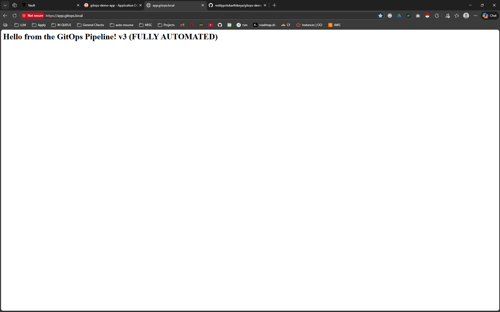
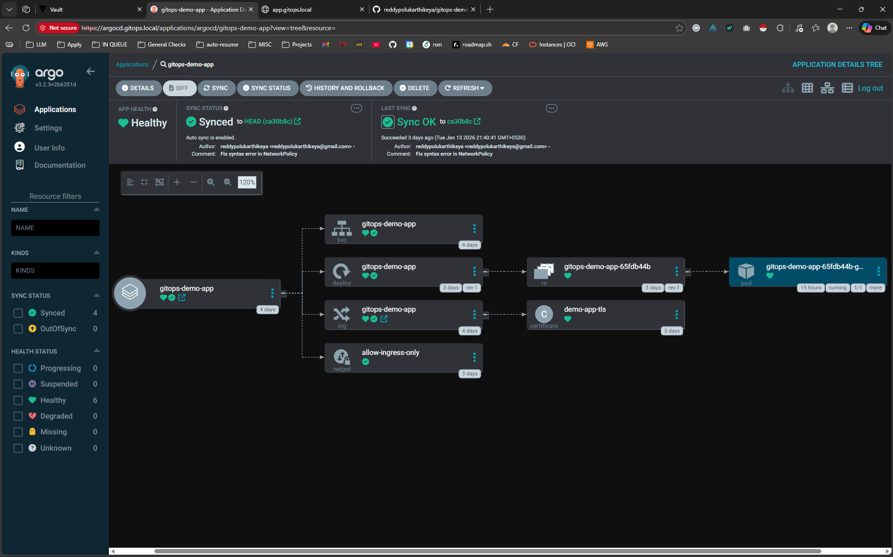

# ⚛️ GitOps Demo Application
### A Sample Web App for the "GitOps Production Pipeline"


---

## 📖 About This App
This is a simple **Node.js/NGINX** web application designed to demonstrate a complete **GitOps workflow**. It serves as the "Source Code" payload for my [Infrastructure Portfolio Project](https://github.com/reddypolukarthikeya/gitops-infra).

The app itself is intentionally simple (a static "Hello World" page) to focus the complexity on the **Deployment Pipeline**, **Secret Injection**, and **Network Security**.

---

## 🚀 The CI/CD Workflow
This repository is the trigger for the entire GitOps loop. Here is what happens when I push code:

1.  **Commit:** I change the text in `index.html` and push to `main`.
2.  **CI (GitHub Actions):**
    * Builds the Docker image.
    * Scans the image for vulnerabilities using **Trivy**.
    * Pushes the artifact to Docker Hub.
3.  **Git Write-Back:**
    * The CI pipeline automatically **clones my Infrastructure Repo**.
    * It updates the Helm Chart `deployment.yaml` with the new specific **Commit SHA** (e.g., `:a1b2c3d`).
    * It pushes the change to the Infra repo.
4.  **Deployment:** **ArgoCD** detects the change in the Infra repo and syncs the new version to the Kubernetes cluster.

---

## 📸 Screenshots

### The Running Application
*Evidence that the pipeline successfully deployed the latest version (v3).*


### The Deployment Topology (ArgoCD)
*Visualizing the Kubernetes resources (Ingress, Service, Pods) managed by GitOps.*


---

## 🛠️ Local Development

To run this app locally without Kubernetes:

```bash
# Build the image
docker build -t gitops-demo .

# Run the container
docker run -p 8080:80 gitops-demo
